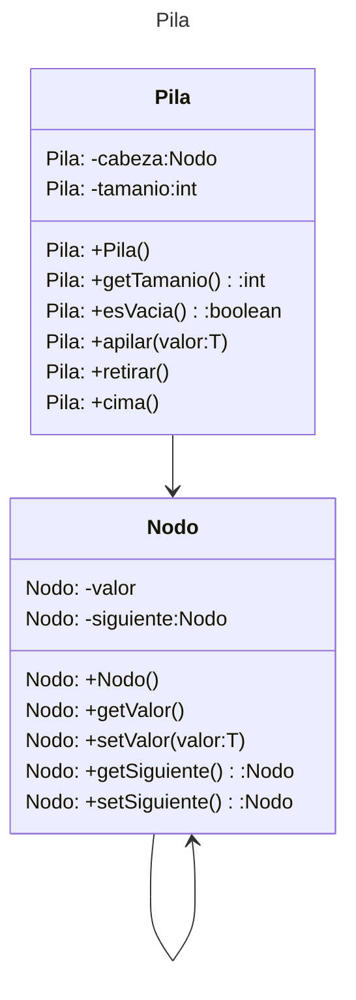
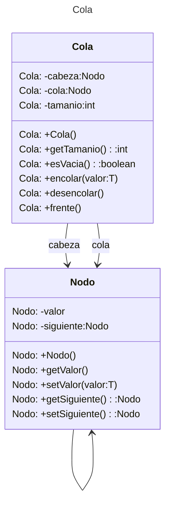
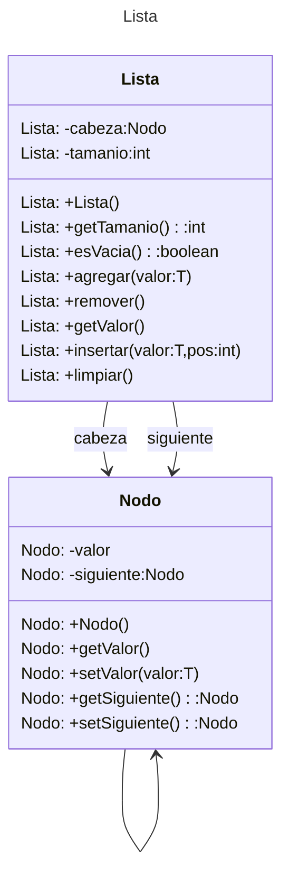

# Proyecto - Estructura de Datos Lineales #

## Descripción del Problema ##

#### Este ejercicio implementa ####
      1. Pilas
      2. Colas
      3. Listas

## I PILAS ###
1.  Nuestra propia estructura *Pila*
Se utiliza una pila dinámica utilizando Nodos enlazados.
Cada nodo almacena un valor y contiene una referencia al siguiente nodo.
En este diagrama de clases existen dos clases: *Nodo* y *Pila*. La clase *Nodo* representa cada uno de los nodos enlazados que almacenan los objetos que se apilan. Tiene dos atributos: *valor* que representa el valor del siguiente nodo, en este caso es una referencia a un objetivo de tipo *T* (genérico).El atributo *siguiente*, representa al siguiente nodo. Los demás métodos son: constructor, *getters* y *setters* de cada atributo.
La clase *Pila* representa la pila con sus operaciones principales de *apilar* y *retirar*.

2. Demostración de la clase *Stack* de Java
3. Problemas que se resuelven con Pilas:
   * 3.1 Evaluación de correspondencia de delimitadores
   * 3.2 Evaluación de expresiones aritméticas


## Diagrama de clase Pila



[Editor en línea](https://mermaid.live/)

[Referencia-Mermaid](https://mermaid.js.org/syntax/classDiagram.html)

## Diagrama de clases UML con draw.io
El repositorio está configurado para crear Diagramas de clases UML con ```draw.io```. Para usarlo simplemente agrega un archivo con extensión ```.drawio.png```, das doble clic sobre el mismo y se activará el editor ```draw.io``` incrustado en ```VSCode``` para edición. Asegúrate de agregar las formas UML en el menú de formas del lado izquierdo (opción ```+Más formas```).

## II COLAS ##

1.  Nuestra propia estructura *Cola*
Esta estructura funciona de manera inversa a la pilas. Los elementos se añaden por un lado y se quitan por el otro mediante la filosofía de **FIFO**

2. Demostración de la Interface *Queue* de Java
3. Problemas que se resuelven con Colas:
   * 3.1 Simulador del despliegue y aterrizaje de aviones
   


## Diagrama de clase Cola



[Editor en línea](https://mermaid.live/)

[Referencia-Mermaid](https://mermaid.js.org/syntax/classDiagram.html)

## Diagrama de clases UML con draw.io
El repositorio está configurado para crear Diagramas de clases UML con ```draw.io```. Para usarlo simplemente agrega un archivo con extensión ```.drawio.png```, das doble clic sobre el mismo y se activará el editor ```draw.io``` incrustado en ```VSCode``` para edición. Asegúrate de agregar las formas UML en el menú de formas del lado izquierdo (opción ```+Más formas```).

## III LISTAS ###
1.  Nuestra propia estructura *Lista*
Es una colección de elementos homogéneos, con una relación lineal entre sus elementos. Esto es, cada elemento tiene un predecesor (excepto el primero) y un sucesor (excepto el último). El orden de los elementos afecta la función de acceso.
Se estudiarán las listas simples, listas dobles, listar circulares simples y listas circulares dobles

2. Demostración de la las Clases: ArrayList y LinkedList de Java
3. Problemas que se resuelven con Listas:
   * 3.1 Aplicación de Lista de contactos personales
   * 3.2 Aplicación de préstamos de recursos
   

## Diagrama de clase Lista



[Editor en línea](https://mermaid.live/)

[Referencia-Mermaid](https://mermaid.js.org/syntax/classDiagram.html)

## Diagrama de clases UML con draw.io
El repositorio está configurado para crear Diagramas de clases UML con ```draw.io```. Para usarlo simplemente agrega un archivo con extensión ```.drawio.png```, das doble clic sobre el mismo y se activará el editor ```draw.io``` incrustado en ```VSCode``` para edición. Asegúrate de agregar las formas UML en el menú de formas del lado izquierdo (opción ```+Más formas```).


## Uso del proyecto con make

### Default - Compilar+Probar+Ejecutar
```
make
```
### Compilar
```
make compile
```
### Probar todo
```
make test
```
### Ejecutar App
```
make run
```
### Limpiar binarios
```
make clean
```
## Comandos Git-Cambios y envío a Autograding

### Por cada cambio importante que haga, actualice su historia usando los comandos:
```
git add .
git commit -m "Descripción del cambio"
```
### Envíe sus actualizaciones a GitHub para Autograding con el comando:
```
git push origin main
```
## Comandos individuales
### Compilar

```
find ./ -type f -name "*.java" > compfiles.txt
javac -encoding utf-8 -d bin -cp lib/junit-platform-console-standalone-1.5.2.jar @compfiles.txt
```
### Ejecutar ambos comandos en 1 sólo paso:
```
find ./ -type f -name "*.java" > compfiles.txt ; javac -encoding utf-8 -d bin -cp lib/junit-platform-console-standalone-1.5.2.jar @compfiles.txt
```

### Ejecutar Todas la pruebas locales de 1 Test Case
```
java -jar lib/junit-platform-console-standalone-1.5.2.jar -class-path bin --select-class miTest.AppTest
```
### Ejecutar 1 prueba local de 1 Test Case
```
java -jar lib/junit-platform-console-standalone-1.5.2.jar -class-path bin --select-method miTest.AppTest#appHasAGreeting
```
### Ejecutar App
```
java -cp bin miPrincipal.Principal
```
Los comandos anteriores están considerados para un ambiente Linux. [Referencia.](https://www.baeldung.com/junit-run-from-command-line)
